# PDMPFlux

| Documentation | Workflows | Code Coverage | Quality Assurance |
|:-------------:|:---------:|:-------------:|:-----------------:|
| [](https://162348.github.io/PDMPFlux.jl/stable/) [](https://162348.github.io/PDMPFlux.jl/dev/) | [](https://github.com/162348/PDMPFlux.jl/actions/workflows/CI.yml?query=branch%3Amain) | [](https://codecov.io/gh/162348/PDMPFlux.jl) | [](https://github.com/JuliaTesting/Aqua.jl) |

## Overview

`PDMPFlux.jl` provides a fast and efficient implementation of **Piecewise Deterministic Markov Process (PDMP)** samplers, using a grid-based Poisson thinning approach proposed in [Andral and Kamatani (2024)](https://arxiv.org/abs/2408.03682).

By the means of the automatic differentiation engines, `PDMPFlux.jl` only requires `dim` and `U`, which is the negative log density of the target distribution (e.g., posterior).
$$
U(x) = -\log p(x) + \text{const}.
$$

## Installation

Currently, `julia >= 1.11` is required for compatibility.

To install the package, use Julia's package manager:

```julia-repl
(@v1.11) pkg> add PDMPFlux
```

## Usage

### Basic

The following example demonstrates how to sample from a standard Gaussian distribution using a Zig-Zag sampler.

```julia
using PDMPFlux

function U_Gauss(x::Vector)
    return sum(x.^2) / 2
end

dim = 10
sampler = ZigZagAD(dim, U_Gauss)

N_sk, N, xinit, vinit = 1_000_000, 1_000_000, zeros(dim), ones(dim)
samples = sample(sampler, N_sk, N, xinit, vinit, seed=2024)

jointplot(samples)
```

### Advanced

For more control, you can manually provide the gradient.

Also, by breaking down the `sample()` function into two steps: `sample_skeleton()` and `sample_from_skeleton()`, you can use `plot_traj()` and `diagnostic()` functions to diagnose the sampler:

```julia
using PDMPFlux
using Zygote

N_sk = 1_000_000 # number of skeleton points
N = 1_000_000 # number of samples

function ∇U_banana(x::Vector)
    mean_x2 = (x[1]^2 - 1)
    return - (- x[1] + -(x[2] - mean_x2) - sum(x[3:end]))  # don't forget the minus sign!
end

dim = 50
xinit = ones(dim)
vinit = ones(dim)
grid_size = 0  # use constant bounds

sampler = ZigZag(dim, ∇U_banana, grid_size=grid_size)  # manually providing the gradient
output = sample_skeleton(sampler, N_sk, xinit, vinit)  # simulate skeleton points
samples = sample_from_skeleton(sampler, N, output)  # get samples from the skeleton points

plot_traj(output, 10000)
diagnostic(output)

jointplot(samples)
```

## Motivation

Markov Chain Monte Carlo (MCMC) methods are standard in sampling from distributions with unknown normalizing constants.

However, PDMPs (also known as Event Chain Monte Carlo) offer a promising alternative due to their 

1. rejection-free simulation strategy,
2. continuous and non-reversible dynamics,

particularly in high-dimensional and big data contexts, as discussed in [Bouchard-Côté et. al. (2018)](https://arxiv.org/abs/1510.02451) and [Bierkens et. al. (2019)](https://arxiv.org/abs/1607.03188).

Despite their potential, practical applications of PDMPs remained limited by the lack of efficient and flexible implementations.

Inspired by [Andral and Kamatani (2024)](https://arxiv.org/abs/2408.03682) and their `jax` based implementation in [`pdmp_jax`](https://github.com/charlyandral/pdmp_jax),`PDMPFlux.jl` is my attempt to fill this gap, with the aid of the existing automatic differentiation engines.

## Implemented PDMP Samplers

### Zig-Zag Sampler

proposed by [Bierkens, Fearnhead & Roberts (2019)](https://projecteuclid.org/journals/annals-of-statistics/volume-47/issue-3/The-Zig-Zag-process-and-super-efficient-sampling-for-Bayesian/10.1214/18-AOS1715.full).


### Bouncy Particle Sampler (BPS)

proposed by [Bouchard-Côte et. al. (2018)](https://www.tandfonline.com/doi/full/10.1080/01621459.2017.1294075).

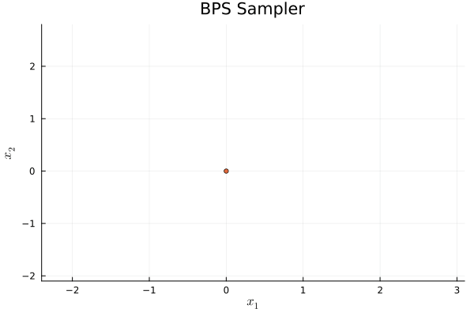

### Forward Event Chain Monte Carlo (Forward ECMC)

proposed by [Michel, Durmus & Sénécal (2020)](https://www.tandfonline.com/doi/full/10.1080/10618600.2020.1750417).

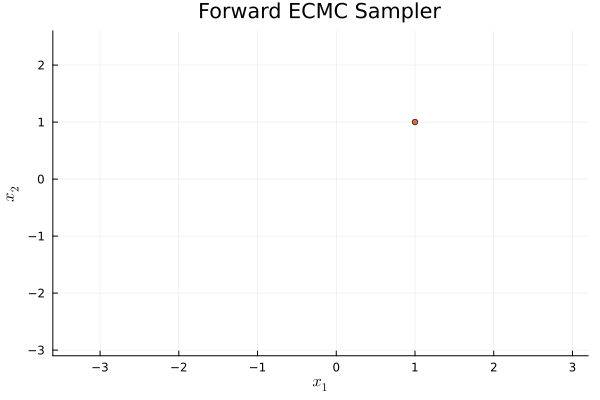

### Boomerang Sampler

proposed by [Bierkens et. al. (2020)](https://proceedings.mlr.press/v119/bierkens20a.html).

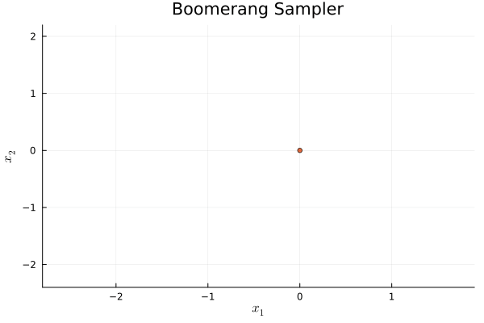

### Speed Up Zig-Zag (SUZZ)

proposed by [Vasdekis and Roberts (2023)](https://projecteuclid.org/journals/annals-of-applied-probability/volume-33/issue-6A/Speed-up-Zig-Zag/10.1214/23-AAP1930.full).

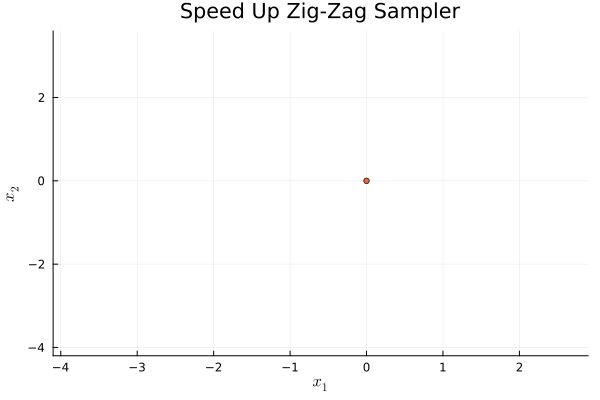

### Sticky Zig-Zag Sampler

proposed in [Bierkens et. al. (2023)](https://link.springer.com/article/10.1007/s11222-022-10180-5).

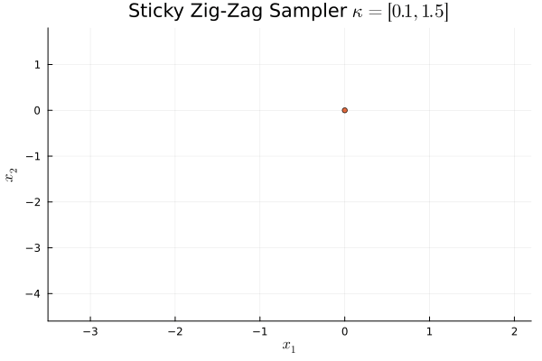

## Gallery

<table>
    <tbody>
        <tr>
            <td style="width: 25%;">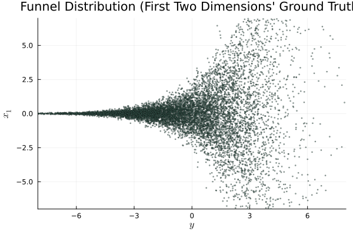</td>
            <td style="width: 25%;">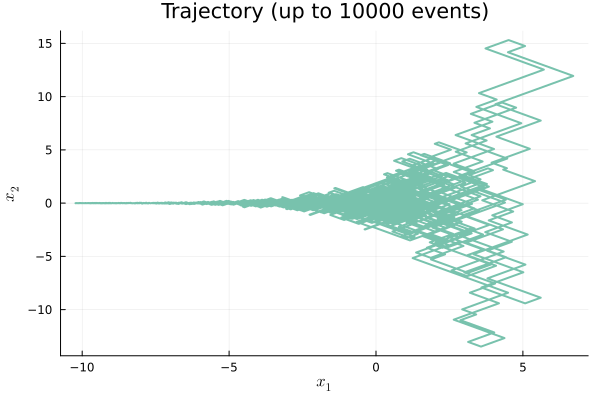</td>
            <td style="width: 25%;">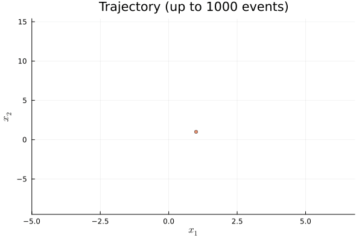</td>
            <td style="width: 25%;">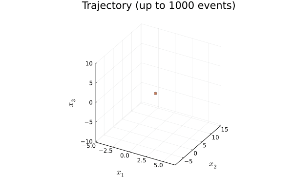</td>
        </tr>
        <tr>
            <td align="center"><a href="examples/ZigZag_Funnel3D.jl"><sup>2D</sup> Funnel Distribution (Ground Truth)</a></td>
            <td align="center"><a href="examples/ZigZag_Funnel3D.jl"><sup>2D</sup> Zig-Zag Trajectory (T<sub>max</sub>=10000)</a></td>
            <td align="center"><a href="examples/ZigZag_Funnel2D.jl"><sup>2D</sup> Zig-Zag on Funnel</a></td>
            <td align="center"><a href="examples/ZigZag_Funnel3D.jl"><sup>3D</sup> Zig-Zag on Funnel</a></td>
        </tr>
        <tr>
            <td style="width: 25%;">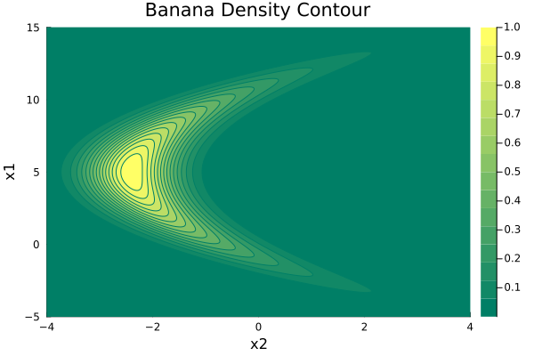</td>
            <td style="width: 25%;">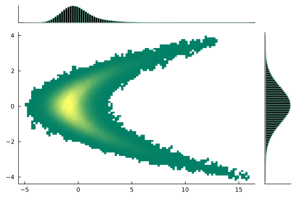</td>
            <td style="width: 25%;">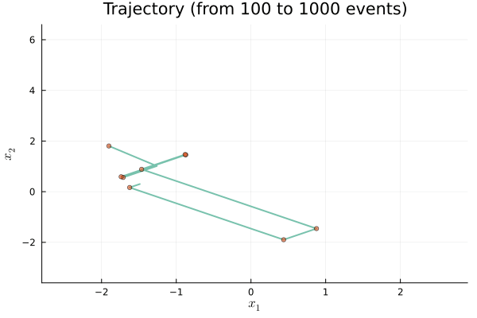</td>
            <td style="width: 25%;">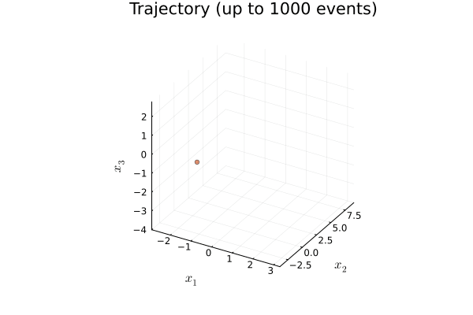</td>
        </tr>
        <tr>
            <td align="center"><a href="test/runtests.jl"><sup>2D</sup> Banana Density Contour (Ground Truth)</a></td>
            <td align="center"><a href="test/runtests.jl"><sup>2D</sup> Zig-Zag Sample Jointplot</a></td>
            <td align="center"><a href="examples/Banana/ZigZag_Banana2D.jl"><sup>2D</sup> Zig-Zag on Banana</a></td>
            <td align="center"><a href="examples/Banana/ZigZag_Banana3D.jl"><sup>3D</sup> Zig-Zag on Banana</a></td>
        </tr>
    </tbody>
</table>

<table>
    <tbody>
        <tr>
            <td style="width: 33%;">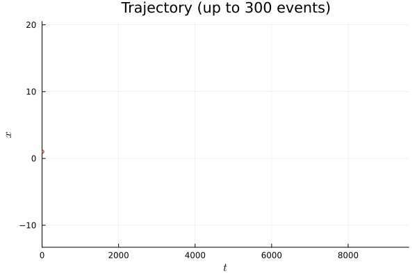</td>
            <td style="width: 33%;">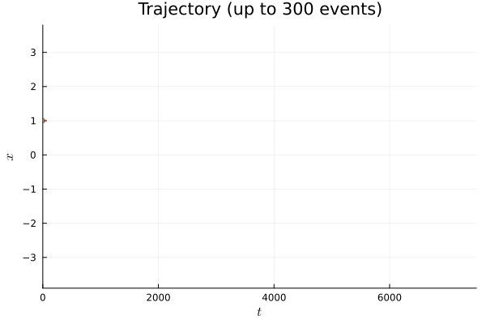</td>
            <td style="width: 33%;"></td>
        </tr>
        <tr>
            <td align="center"><a href="test/1d_test.jl"><sup>1D</sup> Zig-Zag on Cauchy</a></td>
            <td align="center"><a href="test/1d_test.jl"><sup>1D</sup> Zig-Zag on Gaussian</a></td>
            <td align="center"><a href="test/1d_test.jl">Cauchy vs. Gaussian Density Plot</a></td>
        </tr>
        <tr>
            <td style="width: 33%;"></td>
            <td style="width: 33%;"></td>
            <td style="width: 33%;"></td>
        </tr>
        <tr>
            <td style="width: 33%;"></td>
            <td style="width: 33%;"></td>
            <td style="width: 33%;"></td>
        </tr>
    </tbody>
</table>

## Remarks

- The automatic Poisson thinning implementation in `PDMPFlux.jl` is based on the paper [Andral and Kamatani (2024) Automated Techniques for Efficient Sampling of Piecewise-Deterministic Markov Processes](https://arxiv.org/abs/2408.03682) and its accompanying Python package [`pdmp_jax`](https://github.com/charlyandral/pdmp_jax).
- [`pdmp_jax`](https://github.com/charlyandral/pdmp_jax) has a [`jax`](https://github.com/jax-ml/jax) based implementation, and typically about four times faster than current `PDMPFlux.jl`.
- Both [`ForwardDiff.jl`](https://github.com/JuliaDiff/ForwardDiff.jl) and [`Zygote.jl`](https://github.com/FluxML/Zygote.jl) are used for automatic differentiation, each with their own trade-offs.

## References

* [`pdmp_jax`](https://github.com/charlyandral/pdmp_jax) by [Charly Andral](https://github.com/charlyandral), on which this repository is strongly based on and indebted to.
  * [Andral and Kamatani (2024) Automated Techniques for Efficient Sampling of Piecewise-Deterministic Markov Processes](https://arxiv.org/abs/2408.03682)
* [`ForwardDiff.jl`](https://github.com/JuliaDiff/ForwardDiff.jl) and [`Zygote.jl`](https://github.com/FluxML/Zygote.jl) are used for automatic differentiation.
  * [Revels, Lubin, and Papamarkou (2016) Forward-Mode Automatic Differentiation in Julia](https://arxiv.org/abs/1607.07892)
  * [Innes et. al. (2018) Fashionable Modelling with Flux](https://arxiv.org/abs/1811.01457)
* Other PDMP packages:
  * Julia
    * [`ZigZagBoomerang.jl`](https://github.com/mschauer/ZigZagBoomerang.jl) by [Marcel Schauer](https://github.com/mschauer)
    * [`ZZDiffusionBridge`](https://github.com/SebaGraz/ZZDiffusionBridge) by [Sebastiano Grazzi](https://github.com/SebaGraz)
    * [`PDSampler.jl`](https://github.com/alan-turing-institute/PDSampler.jl) by [Alan Turing Institute](https://github.com/alan-turing-institute)
  * R
    * [`rjpdmp`](https://github.com/matt-sutton/rjpdmp) by [Matthew Sutton](https://github.com/matt-sutton)
    * [`RZigZag`](https://github.com/jbierkens/RZigZag) by [Joris Bierkens](https://github.com/jbierkens)
