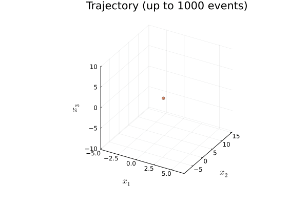
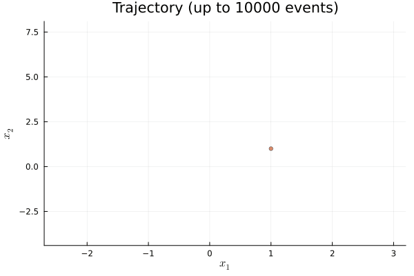
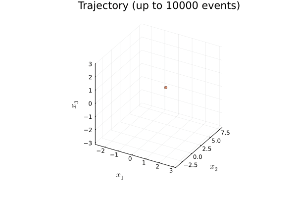

# PDMPFlux

| Documentation | Workflows | Code Coverage | Quality Assurance |
|:-------------:|:---------:|:-------------:|:-----------------:|
| [](https://162348.github.io/PDMPFlux.jl/stable/) [](https://162348.github.io/PDMPFlux.jl/dev/) | [](https://github.com/162348/PDMPFlux.jl/actions/workflows/CI.yml?query=branch%3Amain) | [](https://codecov.io/gh/162348/PDMPFlux.jl) | [](https://github.com/JuliaTesting/Aqua.jl) |

This repository contains a [`Zygote.jl`](https://github.com/FluxML/Zygote.jl) implementation of the PDMP samplers.

Currently, only Zig-Zag samplers are implemented.

## Installation

Currently, `julia >= 1.11` is required, due to some compatibility issues.

To install `PDMPFlux`, open up a Julia-REPL, type `]` to get into Pkg-mode, and type:

```julia-repl
(@v1.11) pkg> add PDMPFlux
```

which will install the package and all dependencies to your local environment.

## Examples

The simplest example may be the following:

```julia
using PDMPFlux

function U_Gauss(x::Vector)
    return sum(x.^2) / 2
end

dim = 10
sampler = ZigZagAD(dim, U_Gauss)

N_sk, N, xinit, vinit = 1_000_000, 1_000_000, zeros(dim), ones(dim)
samples = sample(sampler, N_sk, N, xinit, vinit, seed=2024)

jointplot(samples)
```

To diagnose the sampler, you can manually break down the `sample()` function into two steps: `sample_skeleton()` and `sample_from_skeleton()`:

```julia
using PDMPFlux

N_sk = 1_000_000 # number of skeleton points
N = 1_000_000 # number of samples

function U_banana(x::Vector{Float64})
    mean_x2 = (x[1]^2 - 1)
    return -(- x[1]^2 + -(x[2] - mean_x2)^2 - sum(x[3:end].^2)) / 2
end

dim = 50
xinit = ones(dim)
vinit = ones(dim)
grid_size = 0  # use constant bounds

sampler = ZigZag(dim, ∇U, grid_size=grid_size)  # initialize your Zig-Zag sampler
output = sample_skeleton(sampler, N_sk, xinit, vinit, verbose = true)  # simulate skeleton points
samples = sample_from_skeleton(sampler, N, output)  # get samples from the skeleton points

plot_traj(output, 10000)
diagnostic(output)

jointplot(samples)
```

## Gallery

<table>
    <tbody>
        <tr>
            <td style="width: 25%;"></td>
            <td style="width: 25%;"></td>
            <td style="width: 25%;"></td>
            <td style="width: 25%;"></td>
        </tr>
        <tr>
            <td align="center"><a href="examples/ZigZag_Funnel3D.jl"><sup>2D</sup> Funnel Distribution (Ground Truth)</a></td>
            <td align="center"><a href="examples/ZigZag_Funnel3D.jl"><sup>2D</sup> Zig-Zag Trajectory (T<sub>max</sub>=10000)</a></td>
            <td align="center"><a href="examples/ZigZag_Funnel3D.jl"><sup>2D</sup> Zig-Zag on Funnel</a></td>
            <td align="center"><a href="examples/ZigZag_Funnel3D.jl"><sup>3D</sup> Zig-Zag on Funnel</a></td>
        </tr>
        <tr>
            <td style="width: 25%;"></td>
            <td style="width: 25%;"></td>
            <td style="width: 25%;"></td>
            <td style="width: 25%;"></td>
        </tr>
        <tr>
            <td align="center"><a href="test/runtests.jl"><sup>2D</sup> Banana Density Contour (Ground Truth)</a></td>
            <td align="center"><a href="test/runtests.jl"><sup>2D</sup> Zig-Zag Sample Jointplot</a></td>
            <td align="center"><a href="test/runtests.jl"><sup>2D</sup> Zig-Zag on Banana</a></td>
            <td align="center"><a href="test/runtests.jl"><sup>3D</sup> Zig-Zag on Banana</a></td>
        </tr>
    </tbody>
</table>

<table>
    <tbody>
        <tr>
            <td style="width: 33%;"></td>
            <td style="width: 33%;"></td>
            <td style="width: 33%;"></td>
        </tr>
        <tr>
            <td align="center"><a href="test/1d_test.jl"><sup>1D</sup> Zig-Zag on Cauchy</a></td>
            <td align="center"><a href="test/1d_test.jl"><sup>1D</sup> Zig-Zag on Gaussian</a></td>
            <td align="center"><a href="test/1d_test.jl">Cauchy vs. Gaussian Density Plot</a></td>
        </tr>
    </tbody>
</table>

## Remarks

- The implementation of `PDMPFlux.jl` is based on the paper [Andral and Kamatani (2024) Automated Techniques for Efficient Sampling of Piecewise-Deterministic Markov Processes](https://arxiv.org/abs/2408.03682) and its accompanying Python package [`pdmp_jax`](https://github.com/charlyandral/pdmp_jax).
- [`pdmp_jax`](https://github.com/charlyandral/pdmp_jax) has a [`jax`](https://github.com/jax-ml/jax) based implementation, and typically about four times faster than current `PDMPFlux.jl`.
- Automatic differentiation engines I've tried are [`ForwardDiff.jl`](https://github.com/JuliaDiff/ForwardDiff.jl) and [`Zygote.jl`](https://github.com/FluxML/Zygote.jl). Both have pros and cons. I am still learning the trade-offs.

## References

* [`pdmp_jax`](https://github.com/charlyandral/pdmp_jax) by [Charly Andral](https://github.com/charlyandral), on which this repository is strongly based on.
  * [Andral and Kamatani (2024) Automated Techniques for Efficient Sampling of Piecewise-Deterministic Markov Processes](https://arxiv.org/abs/2408.03682)
* [`ForwardDiff.jl`](https://github.com/JuliaDiff/ForwardDiff.jl) and [`Zygote.jl`](https://github.com/FluxML/Zygote.jl) are used for automatic differentiation.
  * [Revels, Lubin, and Papamarkou (2016) Forward-Mode Automatic Differentiation rin Julia](https://arxiv.org/abs/1607.07892)
  * [Innes et. al. (2018) Fashionable Modelling with Flux](https://arxiv.org/abs/1811.01457)
* Other PDMP packages:
  * Julia
    * [`ZigZagBoomerang.jl`](https://github.com/mschauer/ZigZagBoomerang.jl) by [Marcel Schauer](https://github.com/mschauer)
  * R
    * [`rjpdmp`](https://github.com/matt-sutton/rjpdmp) by [Matthew Sutton](https://github.com/matt-sutton)
